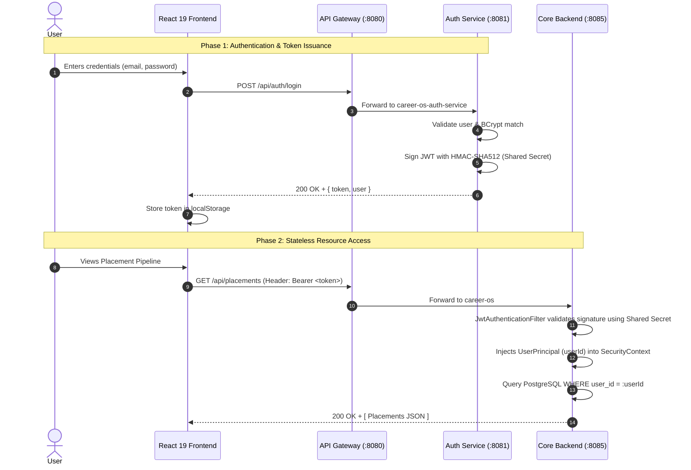

# Career OS — Comprehensive System Architecture & Engineering Blueprints

> **File:** `architecture.md`  
> **Status:** Ground Truth System Specification  
> **Target Audience:** Systems Architects, Staff Engineers, Infrastructure Leads  
> **Version:** 2.0 (Microservices Architecture)  

---

## 1. Executive Architectural Blueprint

Career OS is engineered around a **Decoupled Distributed Microservices Pattern** backed by Netflix Eureka Service Discovery, Spring Cloud Gateway ingress, stateless JWT token authentication, and a modern React 19 Single Page Application.

### 1.1 Complete Architecture Diagram

```mermaid
flowchart TD
    subgraph ClientTier ["Client Application Layer (:5173)"]
        Browser["React 19 SPA / PWA<br>(Vite + TypeScript + Tailwind v4)"]
        SW["Workbox Service Worker<br>(Offline Cache / AutoUpdate)"]
        Browser <--> SW
    end

    subgraph IngressTier ["Edge & Ingress Layer (:8080)"]
        Gateway["Spring Cloud Gateway (:8080)<br>- Dynamic Eureka Service Lookup<br>- Global CORS & Header Deduplication<br>- Route Matching & Forwarding"]
    end

    subgraph RegistryTier ["Service Discovery Layer (:8761)"]
        Eureka["Netflix Eureka Server (:8761)<br>- Dynamic Instance Registry<br>- Heartbeat Monitoring (5s lease renewal)"]
    end

    subgraph ServiceMesh ["Internal Microservice Mesh"]
        AuthSvc["Auth Service (:8081)<br>(career-os-auth-service)<br>- User Authentication<br>- BCrypt Hashing<br>- OAuth2 Google / GitHub<br>- JWT HS512 Signing<br>- User Profiles"]
        
        BackendSvc["Core Backend Service (:8085)<br>(career-os)<br>- Applications CRUD<br>- Placements CRUD<br>- Routine & Habits Engine<br>- Skills Portfolio<br>- Analytics Calculations<br>- Local JWT Verification"]
        
        AISvc["AI Extraction Service (:8082)<br>(ai-extraction-service)<br>- Google Gemini 2.5 Flash SDK<br>- Unstructured Text Parsing<br>- JSON Schema Extraction"]
    end

    subgraph PersistenceTier ["Persistence Layer (PostgreSQL :5432)"]
        AuthDB[("career_os_auth_db<br>- users<br>- user_profiles")]
        CoreDB[("event_tracker_db<br>- applications<br>- placements<br>- skills<br>- routine_tasks<br>- routine_completion")]
    end

    subgraph ExternalServices ["External Cloud Services"]
        GeminiAPI["Google Generative AI API<br>(gemini-2.5-flash)"]
        OAuthGoogle["Google Identity Platform"]
        OAuthGithub["GitHub OAuth Platform"]
    end

    %% Client Ingress
    Browser -->|HTTP REST: VITE_API_URL:8080| Gateway

    %% Gateway & Registry Routing
    Gateway <-.->|Dynamic Instance Lookup| Eureka
    AuthSvc -.->|Register & Heartbeat| Eureka
    BackendSvc -.->|Register & Heartbeat| Eureka
    AISvc -.->|Register & Heartbeat| Eureka

    %% Gateway to Services
    Gateway -->|/api/auth/**, /api/profile/**, /oauth2/**| AuthSvc
    Gateway -->|/api/extraction/**| AISvc
    Gateway -->|/api/** (Applications, Placements, etc.)| BackendSvc

    %% Inter-service calls
    BackendSvc -->|OpenFeign: /api/extraction/*| AISvc

    %% Database connections
    AuthSvc -->|HikariCP: JDBC| AuthDB
    BackendSvc -->|HikariCP: JDBC| CoreDB

    %% External APIs
    AuthSvc -->|OAuth2 Code Exchange| OAuthGoogle
    AuthSvc -->|OAuth2 Code Exchange| OAuthGithub
    AISvc -->|HTTPS REST: JSON Prompt| GeminiAPI
```

---

## 2. Microservice Role Matrix & Separation Boundaries

| Microservice | Internal Port | Eureka ID | Primary Responsibility | Backing Database | External Dependencies |
| :--- | :--- | :--- | :--- | :--- | :--- |
| **API Gateway** | `8080` | `api-gateway` | Edge routing, CORS headers, Netty non-blocking dispatch | None | Eureka Registry |
| **Auth Service** | `8081` | `career-os-auth-service`| Authentication, authorization, token signing, OAuth2, profile records | `career_os_auth_db` | Google OAuth, GitHub OAuth |
| **Core Backend** | `8085` | `career-os` | Core application features: applications, placements, routines, skills, analytics | `event_tracker_db` | AI Extraction Service (via OpenFeign) |
| **AI Extraction**| `8082` | `ai-extraction-service` | LLM unstructured email & text parsing, JSON schema extraction | Stateless (None) | Google Gemini 2.5 Flash API |
| **Discovery** | `8761` | `service-discovery` | Dynamic service registration, health heartbeats | Stateless (Memory) | None |
| **Frontend Web** | `5173` | *(Client)* | Single Page Application, dynamic views, offline caching | Browser `localStorage` | API Gateway (`:8080`) |

---

## 3. Communication Protocols & Inter-Service Messaging

### 3.1 External Ingress (Client to Gateway)
- **Protocol:** HTTP/1.1 REST over JSON.
- **Port:** Target port `8080` configured via `VITE_API_URL`.
- **Security:** Bearer token transmitted in the `Authorization: Bearer <token>` HTTP header.
- **CORS Handling:** Managed globally in `apps/api-gateway/src/main/resources/application.yml`. Deduplicates headers from microservices to prevent browser preflight errors.

### 3.2 Inter-Service Invocation (Core Backend to AI Extraction Service)
- **Technology:** Spring Cloud OpenFeign declarative REST client.
- **Interface:** `apps/backend/src/main/java/com/eventtracker/client/AiExtractionClient.java`.
- **Endpoints:**
  - `POST /api/extraction/placement` (body: `ExtractionRequest`) -> `PlacementDTO`
  - `POST /api/extraction/application` (body: `ExtractionRequest`) -> `ApplicationDTO`
- **Timeouts:** Configured via Spring Cloud OpenFeign settings:
  - Connect Timeout: 5,000 ms
  - Read Timeout: 60,000 ms (allowing LLM reasoning generation window).

### 3.3 Dynamic Service Discovery (Eureka)
- Microservices register as instances upon boot.
- Gateway resolves routes via Spring Cloud LoadBalancer:
  - `uri: lb://career-os-auth-service`
  - `uri: lb://ai-extraction-service`
  - `uri: lb://career-os`
- Lease renewal interval: **5 seconds**; lease expiration duration: **10 seconds** (tuned for zero stale-route deadlocks).

---

## 4. Security Architecture & Identity Protocol

### 4.1 Token Specifications & Signing Topology


### 4.2 OAuth2 Popup Architecture (Cross-Document Messaging)
1. The user clicks "Continue with Google" or "Continue with GitHub".
2. Frontend opens a popup: `window.open('/oauth2/authorization/{provider}', 'OAuthLogin', 'width=500,height=650')`.
3. Gateway forwards the request to `career-os-auth-service`.
4. Spring Security redirects to provider authentication; user grants consent.
5. Provider redirects back to `AuthService` callback handler.
6. `OAuth2LoginSuccessHandler.java` catches the successful authentication, creates/updates the `User` entity, generates an HS512 JWT, and redirects the popup window to:
   `https://<frontend-url>/oauth-success?token=<JWT>`.
7. `OAuthSuccessPage.tsx` inside the popup reads the `token` parameter, sends an HTML5 Cross-Document Message to the parent:
   ```typescript
   window.opener.postMessage({ type: "OAUTH_SUCCESS", token }, window.location.origin);
   window.close();
   ```
8. The parent window's event listener in `LoginPage.tsx` receives the token, stores it in `localStorage`, invalidates queries, and navigates the user to `/dashboard`.

---

## 5. Resilience & Fault Tolerance Strategies

### 5.1 Cold-Start Recovery Protocol
Free-tier and serverless hosting platforms (Render, Railway) transition idle instances to sleep. Career OS implements multi-layered cold-start handling:
1. **Background Warm-Up:** The moment `App.tsx` loads, it dispatches an asynchronous, non-blocking `GET /actuator/health` to trigger server wake-up before the user even finishes typing credentials.
2. **Readiness Polling Loop:** In `useAuth.tsx`, if an authentication token is detected in `localStorage`, the client polls `/actuator/health` every 3 seconds using an `AbortController`.
3. **Timeout Safeguards:** If the server fails to respond within 100 seconds, an interactive retry button is presented to the user rather than leaving the app in an indeterminate frozen state.
4. **Transient Error Segregation:** Network failures (`ERR_NETWORK`, HTTP 502/503/504) are flagged as transient issues; the application does **not** wipe the user's stored session token, preventing unwanted logouts during temporary server reboots.

### 5.2 Decoupled Relational Database Architecture
- In the initial monolithic prototype, `Application` and `Placement` entities held direct `@ManyToOne User user` entity relations.
- In this microservices architecture, identity is strictly segregated. Core entities persist `userId` as a plain scalar `Long`.
- **Benefits:**
  - Zero cross-database distributed joins.
  - Zero cascading locks across service boundaries.
  - Database schemas can be migrated, backed up, or partitioned independently.

---

## 6. Deployment Topography & Containerization

### 6.1 Docker Container Footprint
Each Java microservice is containerized using `eclipse-temurin:17-jre-alpine`:
- **Image Size:** Reduced from ~450MB (full JDK) to under 150MB per microservice.
- **Fast Local Builds:** Maven packaging occurs on the host (`mvn clean package -DskipTests`), and Dockerfiles copy the pre-built `app.jar`, reducing container build times by over 75%.
- **Orchestration:** `docker-compose.yml` orchestrates all 7 services with health checks and network dependencies.

```
Service Composition in Docker:
├── db: postgres:15-alpine (Port 5432)
├── service-discovery: Eureka Server (Port 8761)
├── auth-service: Spring Boot Auth (Port 8081)
├── ai-extraction-service: Spring Boot AI (Port 8082)
├── backend: Spring Boot Core (Port 8085)
├── api-gateway: Spring Cloud Gateway (Port 8080)
└── web: React 19 Frontend (Port 5173)
```
