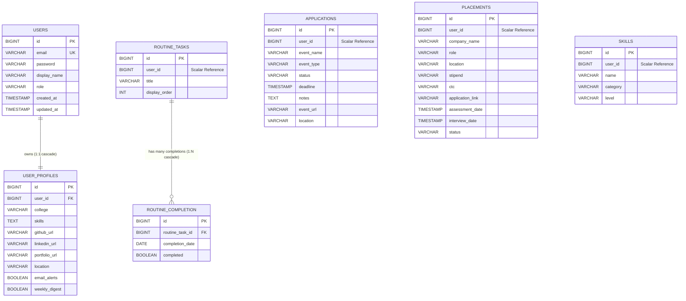

# Career OS — Complete Database Map & Entity Relationship Intelligence

> **File:** `database-map.md`  
> **Status:** Ground Truth System Specification  
> **Databases:** PostgreSQL 15 (`career_os_auth_db`, `event_tracker_db`)  
> **Version:** 2.0 (Decoupled Relational Schema)  

---

## 1. Database Topology & Multi-Database Strategy

To achieve strict service autonomy and eliminate distributed database locks, the data layer is partitioned into two domain databases:

1. **`career_os_auth_db`**: Owned exclusively by **Auth Service** (:8081). Houses user identity, credential hashes, and user profile preferences.
2. **`event_tracker_db`**: Owned exclusively by **Core Backend Service** (:8085). Houses all career assets: event applications, corporate placement pipelines, skills inventory, and daily routines.

> [!IMPORTANT]
> **Decoupled Scalar Reference Pattern:**  
> The Core Backend entities (`applications`, `placements`, `skills`, `routine_tasks`) store `user_id BIGINT` as a raw scalar value rather than a JPA `@ManyToOne` entity join. This design guarantees that database operations on career events never acquire locks or depend on foreign key constraints across different database instances.

---

## 2. Complete Database Schemas & Table Specifications

### 2.1 Database: `career_os_auth_db` (Auth Service)

#### Table: `users`
*Purpose: Authentication credentials, identity records, and role-based permissions.*

| Column Name | Data Type | Nullable | Default | Constraints / Index | Description |
| :--- | :--- | :--- | :--- | :--- | :--- |
| `id` | `BIGSERIAL` | No | Auto-increment | `PRIMARY KEY` | Unique internal user identifier |
| `email` | `VARCHAR(255)` | No | None | `UNIQUE NOT NULL` | Login email address (case-insensitive in app) |
| `password` | `VARCHAR(255)` | No | None | None | BCrypt hashed password or `"oauth-user"` |
| `display_name`| `VARCHAR(255)` | Yes | `NULL` | None | User's preferred display name |
| `role` | `VARCHAR(50)` | No | `'USER'` | None | Role authorization flag (`USER`, `ADMIN`) |
| `created_at` | `TIMESTAMP` | No | `CURRENT_TIMESTAMP` | None | Record creation timestamp |
| `updated_at` | `TIMESTAMP` | No | `CURRENT_TIMESTAMP` | None | Record update timestamp |

---

#### Table: `user_profiles`
*Purpose: Extended student/professional profile data, portfolio links, and notification preferences.*

| Column Name | Data Type | Nullable | Default | Constraints / Index | Description |
| :--- | :--- | :--- | :--- | :--- | :--- |
| `id` | `BIGSERIAL` | No | Auto-increment | `PRIMARY KEY` | Unique profile identifier |
| `user_id` | `BIGINT` | No | None | `UNIQUE REFERENCES users(id) ON DELETE CASCADE` | 1-to-1 foreign key back to `users` |
| `college` | `VARCHAR(255)` | Yes | `NULL` | None | Educational institution / university |
| `skills` | `TEXT` | Yes | `NULL` | None | Comma-separated or serialized skill summary |
| `github_url` | `VARCHAR(255)` | Yes | `NULL` | None | GitHub profile link |
| `linkedin_url`| `VARCHAR(255)` | Yes | `NULL` | None | LinkedIn profile link |
| `portfolio_url`|`VARCHAR(255)` | Yes | `NULL` | None | Personal portfolio / website URL |
| `location` | `VARCHAR(255)` | Yes | `NULL` | None | Geographic location / city |
| `email_alerts`| `BOOLEAN` | No | `TRUE` | None | Email notification preference |
| `weekly_digest`|`BOOLEAN` | No | `FALSE` | None | Weekly performance digest opt-in |
| `created_at` | `TIMESTAMP` | No | `CURRENT_TIMESTAMP` | None | Record creation timestamp |
| `updated_at` | `TIMESTAMP` | No | `CURRENT_TIMESTAMP` | None | Record update timestamp |

---

### 2.2 Database: `event_tracker_db` (Core Backend)

#### Table: `applications`
*Purpose: Tracks hackathons, competitive programming contests, workshops, and career conferences.*

| Column Name | Data Type | Nullable | Default | Constraints / Index | Description |
| :--- | :--- | :--- | :--- | :--- | :--- |
| `id` | `BIGSERIAL` | No | Auto-increment | `PRIMARY KEY` | Unique event application identifier |
| `user_id` | `BIGINT` | No | None | `INDEX` | Owning user scalar identifier |
| `event_name` | `VARCHAR(255)` | No | None | None | Name of the hackathon, contest, or conference |
| `event_type` | `VARCHAR(50)` | No | None | None | Type (`HACKATHON`, `CONTEST`, `CONFERENCE`, etc.) |
| `status` | `VARCHAR(50)` | No | None | `INDEX idx_applications_status` | Status (`APPLIED`, `IN_REVIEW`, `ACCEPTED`, `REJECTED`) |
| `deadline` | `TIMESTAMP` | Yes | `NULL` | None | Application deadline or event date |
| `notes` | `TEXT` | Yes | `NULL` | None | Markdown notes or registration comments |
| `event_url` | `VARCHAR(255)` | Yes | `NULL` | None | External registration or submission URL |
| `location` | `VARCHAR(255)` | Yes | `NULL` | None | Virtual or physical venue location |
| `created_at` | `TIMESTAMP` | No | `CURRENT_TIMESTAMP` | None | Creation timestamp |
| `updated_at` | `TIMESTAMP` | No | `CURRENT_TIMESTAMP` | None | Modification timestamp |

**Indexes & Constraints on `applications`:**
- `CREATE INDEX idx_applications_status ON applications(status);` — Accelerates status filtering.
- `CREATE UNIQUE INDEX unique_user_event_url ON applications (user_id, event_url);` — **Idempotency Guarantee:** Prevents candidates from saving the exact same event URL multiple times.

---

#### Table: `placements`
*Purpose: Full recruitment pipeline for full-time software engineering roles and internships.*

| Column Name | Data Type | Nullable | Default | Constraints / Index | Description |
| :--- | :--- | :--- | :--- | :--- | :--- |
| `id` | `BIGSERIAL` | No | Auto-increment | `PRIMARY KEY` | Unique placement record identifier |
| `user_id` | `BIGINT` | No | None | `INDEX` | Owning user scalar identifier |
| `company_name`| `VARCHAR(255)` | No | None | None | Target hiring company (e.g., Google, Stripe) |
| `role` | `VARCHAR(255)` | No | None | None | Job title (e.g., "Full Stack Engineer") |
| `location` | `VARCHAR(255)` | Yes | `NULL` | None | Job location (e.g., "Remote", "Bangalore") |
| `stipend` | `VARCHAR(255)` | Yes | `NULL` | None | Internship stipend compensation string |
| `ctc` | `VARCHAR(255)` | Yes | `NULL` | None | Full-time CTC compensation figure |
| `application_link`|`VARCHAR(255)`| Yes | `NULL` | None | Portal link or job posting URL |
| `assessment_date`|`TIMESTAMP` | Yes | `NULL` | None | Scheduled Online Assessment (OA) datetime |
| `interview_date` |`TIMESTAMP` | Yes | `NULL` | None | Technical or behavioral interview datetime |
| `status` | `VARCHAR(50)` | No | None | `INDEX idx_placements_status` | Current stage (`APPLIED`, `OA_SCHEDULED`, `INTERVIEW_SCHEDULED`, `OFFER_RECEIVED`, `REJECTED`) |
| `created_at` | `TIMESTAMP` | No | `CURRENT_TIMESTAMP` | None | Record creation timestamp |
| `updated_at` | `TIMESTAMP` | No | `CURRENT_TIMESTAMP` | None | Record update timestamp |

**Indexes & Constraints on `placements`:**
- `CREATE INDEX idx_placements_status ON placements(status);` — Optimizes Kanban column categorization.
- `CREATE UNIQUE INDEX unique_user_company_role_link ON placements (user_id, company_name, role, application_link);` — **Idempotency Guarantee:** Prevents duplicate opportunity tracking.

---

#### Table: `skills`
*Purpose: Technical competency inventory categorized by domain and proficiency.*

| Column Name | Data Type | Nullable | Default | Constraints / Index | Description |
| :--- | :--- | :--- | :--- | :--- | :--- |
| `id` | `BIGSERIAL` | No | Auto-increment | `PRIMARY KEY` | Unique skill identifier |
| `user_id` | `BIGINT` | No | None | `INDEX` | Owning user scalar identifier |
| `name` | `VARCHAR(255)` | No | None | None | Skill title (e.g., "PostgreSQL", "Docker", "Java") |
| `category` | `VARCHAR(50)` | No | None | None | Domain (`Frontend`, `Backend`, `Database`, `DevOps`) |
| `level` | `VARCHAR(50)` | No | None | None | Competency (`BEGINNER`, `INTERMEDIATE`, `ADVANCED`, `EXPERT`) |
| `created_at` | `TIMESTAMP` | No | `CURRENT_TIMESTAMP` | None | Creation timestamp |
| `updated_at` | `TIMESTAMP` | No | `CURRENT_TIMESTAMP` | None | Modification timestamp |

**Indexes & Constraints on `skills`:**
- `CREATE UNIQUE INDEX unique_user_skill ON skills (user_id, name);` — **Idempotency Guarantee:** Prevents duplicate skill entries for a single user.

---

#### Table: `routine_tasks`
*Purpose: Configurable recurring daily habits and preparation tasks.*

| Column Name | Data Type | Nullable | Default | Constraints / Index | Description |
| :--- | :--- | :--- | :--- | :--- | :--- |
| `id` | `BIGSERIAL` | No | Auto-increment | `PRIMARY KEY` | Unique task identifier |
| `user_id` | `BIGINT` | No | None | `INDEX idx_routine_tasks_user_id` | Owning user scalar identifier |
| `title` | `VARCHAR(255)` | No | None | None | Habit title (e.g., "1 LeetCode Medium", "Read Tech Blog") |
| `display_order`| `INT` | No | `0` | None | Sorting order in the UI checklist |
| `created_at` | `TIMESTAMP` | No | `CURRENT_TIMESTAMP` | None | Creation timestamp |
| `updated_at` | `TIMESTAMP` | No | `CURRENT_TIMESTAMP` | None | Modification timestamp |

---

#### Table: `routine_completion`
*Purpose: Historical daily completion marks for habit streak calculations.*

| Column Name | Data Type | Nullable | Default | Constraints / Index | Description |
| :--- | :--- | :--- | :--- | :--- | :--- |
| `id` | `BIGSERIAL` | No | Auto-increment | `PRIMARY KEY` | Unique completion record identifier |
| `routine_task_id`| `BIGINT` | No | None | `REFERENCES routine_tasks(id) ON DELETE CASCADE` | Foreign key to parent routine task |
| `completion_date`| `DATE` | No | None | `INDEX` | Calendar date (`YYYY-MM-DD`) |
| `completed` | `BOOLEAN` | No | `FALSE` | None | Boolean completion toggle flag |
| `created_at` | `TIMESTAMP` | No | `CURRENT_TIMESTAMP` | None | Creation timestamp |
| `updated_at` | `TIMESTAMP` | No | `CURRENT_TIMESTAMP` | None | Modification timestamp |

**Indexes & Constraints on `routine_completion`:**
- `CONSTRAINT uq_routine_completion UNIQUE (routine_task_id, completion_date);` — **Idempotency Guarantee:** Ensures exactly one record per task per calendar day.

---

## 3. Entity Relationships Diagram (ERD)

