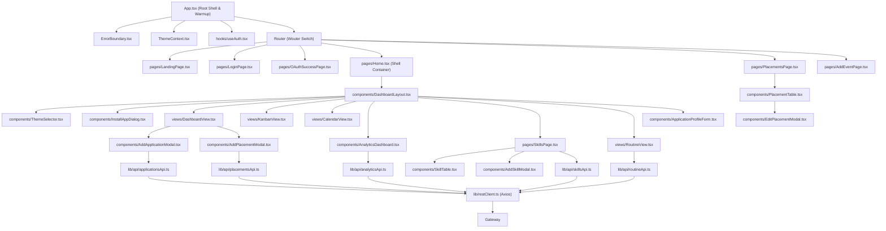

# Career OS — Complete Dependency Graph & System Criticality Analysis

> **File:** `dependency-graph.md`  
> **Status:** Ground Truth System Specification  
> **Version:** 2.0 (Microservices Architecture)  

---

## 1. Microservice Dependency Graph & Call Chains

```mermaid
flowchart TD
    subgraph Clients
        WebClient["apps/web (React 19 Frontend)"]
    end

    subgraph GatewayEdge
        Gateway["apps/api-gateway (Spring Cloud Gateway :8080)"]
    end

    subgraph ServiceRegistry
        Eureka["apps/service-discovery (Netflix Eureka :8761)"]
    end

    subgraph Services
        AuthSvc["apps/auth-service (:8081)"]
        BackendSvc["apps/backend (:8085)"]
        AISvc["apps/ai-extraction-service (:8082)"]
    end

    subgraph Databases
        AuthDB[("career_os_auth_db")]
        CoreDB[("event_tracker_db")]
    end

    subgraph ThirdParty
        GoogleGemini["Google Gemini LLM API"]
        OAuthProviders["Google & GitHub OAuth"]
    end

    %% Edge Ingress
    WebClient -->|All API traffic| Gateway

    %% Discovery
    Gateway <-.->|Dynamic Route Lookup| Eureka
    AuthSvc -.->|Heartbeat Registration| Eureka
    BackendSvc -.->|Heartbeat Registration| Eureka
    AISvc -.->|Heartbeat Registration| Eureka

    %% Gateway to Downstream
    Gateway -->|/api/auth/**, /api/profile/**| AuthSvc
    Gateway -->|/api/extraction/**| AISvc
    Gateway -->|/api/** (Core)| BackendSvc

    %% Internal Feign Calls
    BackendSvc -->|AiExtractionClient (OpenFeign)| AISvc

    %% DB Links
    AuthSvc --> AuthDB
    BackendSvc --> CoreDB

    %% External APIs
    AISvc --> GoogleGemini
    AuthSvc --> OAuthProviders
```

---

## 2. Frontend Component Hierarchy & Import Chains



---

## 3. High-Impact & Critical System Files

These files constitute the core foundations of the application. **Modifying them requires extreme caution**:

### 3.1 Backend Core Files

| File Path | Criticality Level | Rationale / Architectural Impact |
| :--- | :--- | :--- |
| `apps/backend/src/main/resources/schema.sql` | 🔴 **CRITICAL** | Defines the entire PostgreSQL relational schema, column types, default values, and composite unique indices. Changing this breaks entity mapping and data idempotency. |
| `apps/backend/src/main/java/com/eventtracker/security/JwtAuthenticationFilter.java` | 🔴 **CRITICAL** | Validates HS512 signatures on every incoming request. Any bug here locks out all authenticated users or introduces severe authorization bypass vulnerabilities. |
| `apps/backend/src/main/java/com/eventtracker/security/SecurityConfig.java` | 🔴 **CRITICAL** | Configures stateless session policy, CORS origins, and public vs authenticated endpoint matcher rules. |
| `apps/api-gateway/src/main/resources/application.yml` | 🔴 **CRITICAL** | Core routing matrix for Spring Cloud Gateway. Misconfigurations cause 404/502 routing failures across all frontend interactions. |
| `apps/backend/src/main/java/com/eventtracker/client/AiExtractionClient.java` | 🟠 **HIGH** | OpenFeign bridge to the AI microservice. Signature changes or timeout mismatches break email parsing in both event and placement modals. |
| `apps/auth-service/src/main/java/com/careeros/auth/security/oauth/OAuth2LoginSuccessHandler.java` | 🟠 **HIGH** | Manages OAuth redirect URLs, sanitization, user creation, and postMessage payload formulation. |
| `apps/ai-extraction-service/src/main/java/com/careeros/ai/service/GeminiExtractionService.java` | 🟠 **HIGH** | Gemini prompt engineering, schema extraction, and fallback retry loops. |

---

### 3.2 Frontend Core Files

| File Path | Criticality Level | Rationale / Architectural Impact |
| :--- | :--- | :--- |
| `apps/web/src/lib/restClient.ts` | 🔴 **CRITICAL** | Central Axios instance. Injects Bearer tokens, logs latency profiling, handles 401 redirects, and standardizes error formatting for the entire frontend. |
| `apps/web/src/hooks/useAuth.tsx` | 🔴 **CRITICAL** | Owns session tokens, `meQuery`, backend health polling loops, and cold-start recovery state. Breaking this prevents users from signing in or causes infinite redirect loops. |
| `apps/web/src/App.tsx` | 🔴 **CRITICAL** | Root router, authentication gatekeeper, and background backend health warm-up initiator. |
| `apps/web/src/contexts/ThemeContext.tsx` | 🟡 **MEDIUM** | Manages CSS token switching across the 5 design system presets. |

---

## 4. Failure Modes & Cascading Risk Analysis

| Failure Scenario | Immediate Consequence | Blast Radius | Automated Mitigation In Place |
| :--- | :--- | :--- | :--- |
| **Service Discovery (Eureka) Crashes** | Gateway cannot dynamically resolve downstream service instances via `lb://...`. | Complete API outage | Instances retain cached registries briefly; local Docker-compose restarts container automatically. |
| **Auth Service (:8081) Down** | New logins, registrations, and OAuth flows fail. | Login & Profile only | **Core operations survive:** Already logged-in users continue accessing placements, applications, routines, and skills on Core Backend (:8085) because JWTs are validated locally. |
| **AI Extraction Service (:8082) Down or Gemini Rate-Limited** | AI quick-entry buttons in modals return error alerts. | AI Parsing only | Manual entry forms in modals remain 100% functional. Core database transactions never block. |
| **PostgreSQL Dormant (Cold-Start)** | Initial HTTP requests take 15-45s or return 503 while spinning up. | Temporary read delays | `useAuth.tsx` polls `/actuator/health` every 3s and keeps token stored, preventing session loss. |
