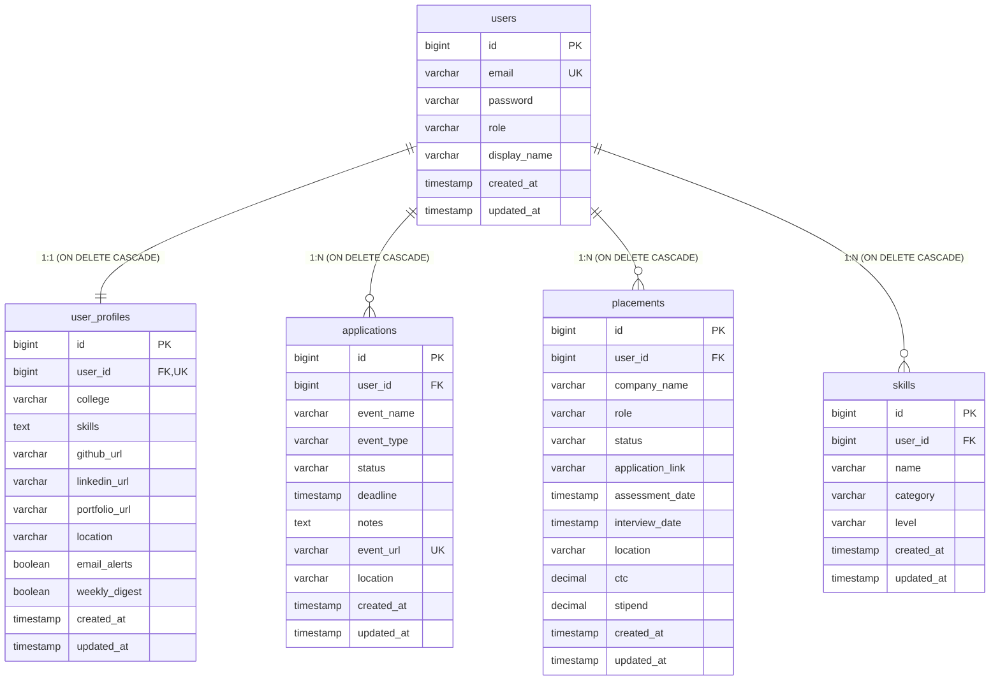

# Security & Database Architecture Specifications

This guide describes how stateless user authentication, Spring Security filters, CORS configurations, database entity schemas, indexing strategy, and parameterized filter queries are implemented in Career OS.

---

## 🔒 1. Security Architecture

Our security configuration is managed by Spring Security and JJWT.

### A. Stateless Filter Chain Configuration (`SecurityConfig.java`)
We disable traditional server-side state components and configure a completely stateless filter chain:
* **Session Creation Policy:** `SessionCreationPolicy.STATELESS`. The server does not maintain HTTP session records or cookies. Every incoming request is treated as independent and must contain valid cryptographic authorization details.
* **HTTP Basic / Form Login:** Disabled. All credentials verification goes through a RESTful JSON POST route on `AuthController.java` or through OAuth callbacks.
* **CSRF (Cross-Site Request Forgery) Mitigation:** Disabled. Because the JWT token is not automatically sent by the browser in cookie headers (it must be manually injected via the client request interceptor's `Authorization: Bearer` header), the application is protected against CSRF by design.
* **CORS (Cross-Origin Resource Sharing):** Restricts incoming requests to explicit whitelisted origins. In development, this maps to `http://localhost:5173`. In production, this matches your verified frontend hosting domain. Pre-flight `OPTIONS` requests are handled dynamically to check permissions.

### B. Role-Based Permissions & Actuator Hardening
* **Public Endpoints:** `/api/auth/login`, `/api/auth/register`, `/oauth2/**`, `/login/oauth2/**`, and `/actuator/health` (which serves as a cold-start wakeup probe) are open to everyone.
* **Protected API Endpoints:** `/api/**` require authenticated JWT authorization.
* **System Actuator Endpoints:** `/actuator/**` (except `/health`) are restricted to the `ADMIN` role to prevent info leaks.

---

## 🔑 2. JWT Configuration & Token Provider

### A. Token Generation & Validation (`JwtTokenProvider.java`)
JWT tokens are generated, signed, and validated locally by the `JwtTokenProvider` class:
* **Signing Algorithm:** Enforces **HMAC SHA-512 (HS512)**. We enforce a startup check to ensure that `jwtSecret` is a cryptographically strong string of at least **64 bytes** (512 bits). If the key is weak or missing, the application halts.
* **JWT Claims Structure:** Cryptographically signs three claims:
  * `userId` (Long)
  * `email` (String)
  * `role` (String)
* **JWT Expiration (15 Days):** Set via properties to **`1296000000` ms** (15 days). This gives users a persistent session without forcing logins.

### B. Authentication Filtering (`JwtAuthenticationFilter.java`)
This filter intercepts every incoming request before it reaches Spring Security's controllers:
1. Extracts the `Authorization` header.
2. Checks for a `Bearer ` prefix and extracts the token string.
3. Validates the token's cryptographic signature against the signing key.
4. Decrypts the claims (`userId`, `email`).
5. Queries the database for the user's records, creates a `UsernamePasswordAuthenticationToken` context, and inserts it into Spring Security's thread-local `SecurityContextHolder`.

---

## 🗄️ 3. Database Schema & Entity Relationships

We use **PostgreSQL** in both production and development environments. The connection credentials and validation flags are loaded from the active profile config.



### Table Schema Definitions (`schema.sql`)

```sql
-- Core user credentials
CREATE TABLE IF NOT EXISTS users (
    id BIGSERIAL PRIMARY KEY,
    email VARCHAR(255) NOT NULL UNIQUE,
    password VARCHAR(255) NOT NULL,
    role VARCHAR(50) DEFAULT 'USER' NOT NULL,
    display_name VARCHAR(255),
    created_at TIMESTAMP DEFAULT CURRENT_TIMESTAMP NOT NULL,
    updated_at TIMESTAMP DEFAULT CURRENT_TIMESTAMP NOT NULL
);

-- Extended profile options
CREATE TABLE IF NOT EXISTS user_profiles (
    id BIGSERIAL PRIMARY KEY,
    user_id BIGINT UNIQUE NOT NULL REFERENCES users(id) ON DELETE CASCADE,
    college VARCHAR(255),
    skills TEXT,
    github_url VARCHAR(255),
    linkedin_url VARCHAR(255),
    portfolio_url VARCHAR(255),
    location VARCHAR(255),
    email_alerts BOOLEAN DEFAULT TRUE NOT NULL,
    weekly_digest BOOLEAN DEFAULT FALSE NOT NULL,
    created_at TIMESTAMP DEFAULT CURRENT_TIMESTAMP NOT NULL,
    updated_at TIMESTAMP DEFAULT CURRENT_TIMESTAMP NOT NULL
);

-- Skills inventory
CREATE TABLE IF NOT EXISTS skills (
    id BIGSERIAL PRIMARY KEY,
    user_id BIGINT NOT NULL REFERENCES users(id) ON DELETE CASCADE,
    name VARCHAR(255) NOT NULL,
    category VARCHAR(50) NOT NULL,
    level VARCHAR(50) NOT NULL,
    created_at TIMESTAMP DEFAULT CURRENT_TIMESTAMP NOT NULL,
    updated_at TIMESTAMP DEFAULT CURRENT_TIMESTAMP NOT NULL
);

-- Hackathon and Event applications
CREATE TABLE IF NOT EXISTS applications (
    id BIGSERIAL PRIMARY KEY,
    user_id BIGINT NOT NULL REFERENCES users(id) ON DELETE CASCADE,
    event_name VARCHAR(255) NOT NULL,
    event_type VARCHAR(50) NOT NULL,
    status VARCHAR(50) NOT NULL,
    deadline TIMESTAMP,
    notes TEXT,
    event_url VARCHAR(255),
    location VARCHAR(255),
    created_at TIMESTAMP DEFAULT CURRENT_TIMESTAMP NOT NULL,
    updated_at TIMESTAMP DEFAULT CURRENT_TIMESTAMP NOT NULL,
    CONSTRAINT unique_user_event_url UNIQUE (user_id, event_url)
);

-- Job and placement opportunity tracking
CREATE TABLE IF NOT EXISTS placements (
    id BIGSERIAL PRIMARY KEY,
    user_id BIGINT NOT NULL REFERENCES users(id) ON DELETE CASCADE,
    company_name VARCHAR(255) NOT NULL,
    role VARCHAR(255) NOT NULL,
    status VARCHAR(50) NOT NULL,
    application_link VARCHAR(255),
    assessment_date TIMESTAMP,
    interview_date TIMESTAMP,
    location VARCHAR(255),
    ctc NUMERIC(15, 2),
    stipend NUMERIC(15, 2),
    created_at TIMESTAMP DEFAULT CURRENT_TIMESTAMP NOT NULL,
    updated_at TIMESTAMP DEFAULT CURRENT_TIMESTAMP NOT NULL
);
```

---

## 🔍 4. Query Security Scoping & Filter Parameter Performance

Database query efficiency is maintained by using foreign-key indexed queries combined with parameter short-circuiting.

### A. Index-Driven Scoping & Data Isolation
To ensure absolute data separation (preventing Cross-Tenant Data Access):
* Every query is scoped by the authenticated user's ID (`WHERE user_id = :userId`).
* The foreign key reference `user_id` is automatically indexed in B-Tree structures.
* The query optimizer resolves user scoping in `O(log N)` complexity, pruning the indexes without performing costly sequence sweeps.

### B. Optional Parameter HQL Short-Circuit Evaluation
Instead of programmatically appending SQL strings or utilizing complex Criteria Builders, Career OS uses dynamic JPQL query parameter evaluations:

```sql
SELECT a FROM Application a WHERE a.user.id = :userId 
  AND (:status IS NULL OR a.status = :status) 
  AND (:eventType IS NULL OR a.eventType = :eventType)
```

#### SQL Compile-Time Mechanics:
1. **Unfiltered Requests:** If the user selects "All" status and "All" event types, the parameters `:status` and `:eventType` are bound as `NULL`.
2. **Boolean Short-Circuiting:** 
   * Database engines evaluate `NULL IS NULL` as `TRUE`.
   * For the Status sub-clause: `TRUE OR a.status = NULL` evaluates to `TRUE`.
   * For the Event Type sub-clause: `TRUE OR a.eventType = NULL` evaluates to `TRUE`.
3. **Execution Plan:** The query compiler recognizes these logical tautologies (conditions that are always `TRUE`) and completely removes them from the evaluation engine during execution planning. The database executes the optimized query plan identically to:
   ```sql
   SELECT * FROM applications WHERE user_id = ?
   ```
4. **Filtered Requests:** If the user filters by `Applied`, the database binds `:status = 'Applied'`. The clause `:status IS NULL` evaluates to `FALSE`, forcing the optimizer to evaluate `a.status = 'Applied'`, correctly restricting results.

