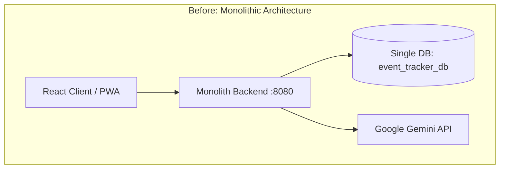
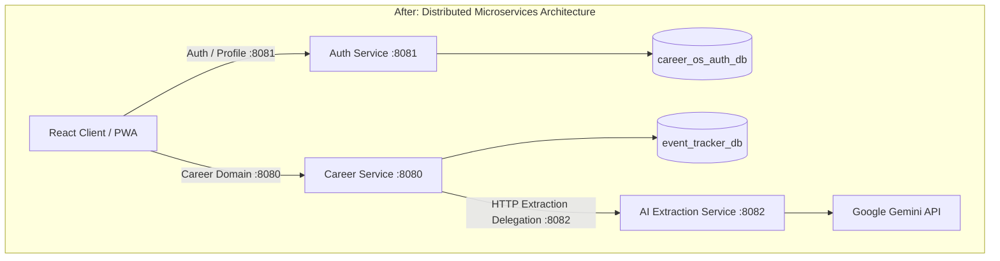

# Monolith to Microservices Migration Guide: Career OS

This document outlines the architectural transformation of **Career OS** from a Spring Boot monolith into a decoupled, distributed microservices architecture.

---

## 1. High-Level Architectural Evolution

---

## 2. Core Separation Boundaries

| Service | Port | Database | Primary Responsibilities |
| :--- | :--- | :--- | :--- |
| **Auth Service** | `8081` | `career_os_auth_db` | User registration, login, OAuth2, profile management, JWT generation & signing. |
| **Career Service** | `8080` | `event_tracker_db` | Applications, placements, skills, routines, tasks, and analytics. |
| **AI Extraction Service**| `8082` | *Stateless (None)* | Email text classification and AI-assisted application/placement extraction via Google Gemini. |
| **Frontend Web App** | `5173` | *Browser LocalStorage* | Dynamic dispatching between services based on domain route. |

---

## 3. Step-by-Step Migration Process

### Step 1: Database & Identity Severing
- **Identified Tight Coupling:** The monolith used direct JPA `@ManyToOne private User user;` relations on `Application`, `Placement`, `Skill`, and `RoutineTask`.
- **Decoupled Entities:** Replaced all direct `User` entity relationships with a scalar `private Long userId;`.
- **Database Separation:** Created `career_os_auth_db` and migrated existing `users` and `user_profiles` records so the Auth Service owns user identity independently.

### Step 2: Auth Service Extraction (`apps/auth-service`)
- Created a standalone Spring Boot project on port `8081`.
- Migrated `AuthController`, `ProfileController`, `UserService`, `UserRepository`, `UserProfileRepository`, and OAuth2 handlers.
- Retained the authority to sign JWTs with the shared `JWT_SECRET`.

### Step 3: Career Service Refactoring (`apps/backend`)
- Converted Career Service into a stateless resource server on port `8080`.
- Kept a lightweight `UserPrincipal` and `JwtAuthenticationFilter` that locally verifies JWT signatures using `JWT_SECRET` without making network calls to Auth Service.
- Removed obsolete user registration and authentication endpoints.

### Step 4: AI Extraction Service Extraction (`apps/ai-extraction-service`)
- Created a lightweight Spring Boot service on port `8082`.
- Migrated Google Gemini prompts, response parsers, and template builders.
- Replaced the direct Gemini SDK inside Career Service with a stateless HTTP client (`RestClient`/`RestTemplate`) delegating extraction requests to `:8082`.

### Step 5: Frontend Dynamic Routing (`apps/web`)
- Updated `restClient.ts` to dynamically route `/api/auth/*` and `/api/profile/*` requests to port `8081` and domain requests (`/api/applications`, `/api/placements`, `/api/skills`, `/api/routines`) to port `8080`.

---

## 4. Key Architectural Decisions

1. **Independent JWT Verification (Shared Secret):**
   Instead of calling the Auth Service for every incoming request (which introduces latency and single-point-of-failure bottlenecks), Career Service verifies the token signature locally using the shared HS512 secret.
2. **Elimination of Foreign Keys Across Service Boundaries:**
   Career Service persists `userId` as a primitive integer identifier rather than an entity reference, eliminating cross-database joins.
3. **Stateless AI Delegation:**
   AI extraction is isolated so CPU-intensive prompt formatting and external Gemini API latencies do not block Career Service database transactions.
