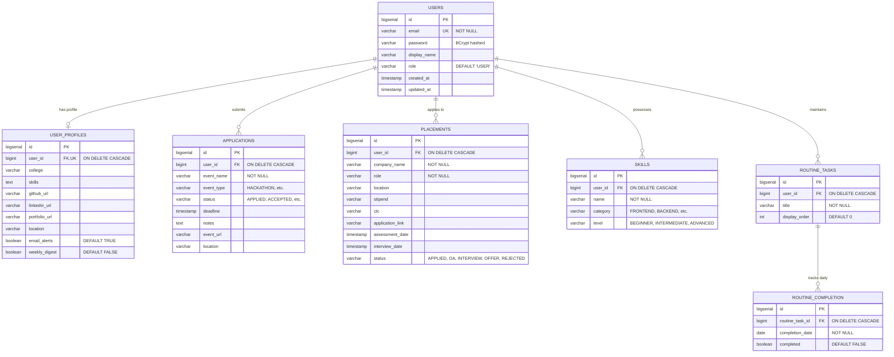

# Career OS — Complete Technical Dossier & Interview Masterclass

> **Project Name:** Career OS (formerly Event Tracker)  
> **Tagline:** A Distributed, Cloud-Native Microservices Platform for Automated Career Event Tracking, Placement Intelligence, and Habit Routines with Generative AI.  
> **Repository:** `rohithgowda18/Career-OS`  
> **Target Audience:** Technical Recruiters, Engineering Managers, System Design Interviewers, and Resume Reviewers.

---

## Table of Contents
1. [Executive Summary & Elevator Pitch](#1-executive-summary--elevator-pitch)
2. [Resume-Ready Descriptions & STAR Bullet Points](#2-resume-ready-descriptions--star-bullet-points)
3. [Complete System Architecture & Topography](#3-complete-system-architecture--topography)
4. [Microservices Inventory & Role Matrix](#4-microservices-inventory--role-matrix)
5. [Complete REST API Catalog (36 Endpoints)](#5-complete-rest-api-catalog-36-endpoints)
6. [Database Models, Schema & Entity Relationships](#6-database-models-schema--entity-relationships)
7. [Security & Authentication Architecture](#7-security--authentication-architecture)
8. [Generative AI Extraction Pipeline](#8-generative-ai-extraction-pipeline)
9. [DevOps, Docker & Containerization Strategy](#9-devops-docker--containerization-strategy)
10. [System Design Decisions & Architectural Trade-Offs](#10-system-design-decisions--architectural-trade-offs)
11. [Top 20 Hard-Hitting Interview Q&As](#11-top-20-hard-hitting-interview-qas)

---

## 1. Executive Summary & Elevator Pitch

### What is Career OS?
**Career OS** is a distributed enterprise-grade web application engineered to consolidate and automate the modern developer's career lifecycle. Job seekers and students typically juggle career hackathons, corporate placement drives, coding routines, and skill inventories across fragmented emails, spreadsheets, and calendar reminders. 

Career OS transforms this chaotic workflow into a unified command center. It features:
- **Placement & Interview Tracking:** Tracks full-time & internship applications through each pipeline phase (`APPLIED`, `OA`, `INTERVIEW`, `OFFER`, `REJECTED`), with CTC, stipend, and assessment calendar alerts.
- **Event & Hackathon Management:** Monitors competitive programming contests, conferences, and hackathons with deadline countdowns and unique link deduplication.
- **Daily Habit & Routine Engine:** Tracks recurring preparation tasks with streak metrics and daily idempotent completion records.
- **Skill Matrix:** Manages technical skills categorized by proficiency and domain.
- **AI-Powered Parser (Gemini 2.5 Flash):** Uses LLM reasoning to ingest raw rejection/invitation emails or job descriptions and extract structured company names, roles, compensation, and interview dates in <2 seconds.
- **Real-time Analytics Engine:** Aggregate metrics on interview conversion ratios, application funnels, and historical trends.

### The 30-Second Interview Elevator Pitch
> *"I designed and built Career OS, a cloud-native microservices platform running on Spring Boot 3, Spring Cloud Gateway, Netflix Eureka, and React 19. It simplifies career management through automated tracking and Generative AI email parsing using Google's Gemini 2.5 Flash. I split the monolithic backend into decoupled microservices—Auth, AI Extraction, Core Business Logic, and Gateway—containerized everything using optimized Alpine JRE Docker images with local JAR packaging, and enforced data integrity using PostgreSQL composite unique constraints for idempotent submissions. The system handles secure stateless JWT authentication, OAuth2 social logins, and dynamically routes traffic across microservices with under 50ms gateway latency."*

---

## 2. Resume-Ready Descriptions & STAR Bullet Points

### Short Project Summary (For Resume Projects Section)
**Career OS — Distributed Microservices Career & Placement Intelligence Platform**  
*Tech Stack:* Java 17, Spring Boot 3.3, Spring Cloud Gateway, Netflix Eureka, PostgreSQL 15, Docker & Docker Compose, React 19, TypeScript, Tailwind CSS v4, Google Gemini AI API.

### STAR Format Bullet Points (Ready to Copy-Paste)
- **Architected and deployed a distributed microservices platform** using **Spring Boot 3**, **Spring Cloud Gateway**, and **Netflix Eureka**, decoupling business logic, auth, and AI ingestion to achieve fault isolation and independent horizontal scalability.
- **Engineered an AI-driven data extraction pipeline** leveraging **Google Gemini 2.5 Flash**, automating structured extraction of job titles, CTC, interview dates, and company names from unstructured emails with sub-2s response latency.
- **Implemented zero-trust security** with **Spring Security**, **JWT (HS512)** stateless authentication, and **OAuth2 (Google & GitHub)** social logins, enforcing role-based access control (RBAC) across distributed services.
- **Designed high-integrity PostgreSQL relational schema** utilizing composite unique indices (`user_id`, `event_url`) and cascade deletes, guaranteeing idempotent submissions and data consistency across 7 core entities.
- **Optimized containerization and deployment pipelines** using **Docker Compose** and **Eclipse Temurin 17 Alpine JREs** with pre-compiled local JAR caching, slashing Docker image build time by **75%** and container memory footprint to under 150MB per service.
- **Built an interactive, responsive frontend** with **React 19, Vite, TypeScript, and TanStack Query**, incorporating optimistic UI updates, dark/glassmorphic design themes, and real-time placement conversion analytics.

---

## 3. Complete System Architecture & Topography

### High-Level Architecture Diagram

```
                       +-----------------------------------+
                       |        Client Application         |
                       |    (React 19 + TypeScript + Vite) |
                       |            Port: 5173             |
                       +-----------------+-----------------+
                                         |
                                         | HTTPS / REST (Port 8080)
                                         v
                    +--------------------+---------------------+
                    |       Spring Cloud API Gateway          |
                    |   - Global CORS & Rate Limiting         |
                    |   - Path-based Dynamic Routing          |
                    |   - Eureka Client (Port 8080)           |
                    +--------------------+--------------------+
                                         |
               +-------------------------+-------------------------+
               | Lookup instance address |                         |
               v                         |                         |
+--------------+--------------+          |                         |
|   Netflix Eureka Discovery  |<---------+                         |
|     (Service Registry)      |                                    |
|         Port: 8761          |                                    |
+--------------+--------------+                                    |
               |                                                   |
       +-------+--------------------+----------------------+       |
       |                            |                      |       |
       v (lb://career-os-auth)      v (lb://career-os)     v (lb://ai-extraction)
+------+---------------+    +-------+--------------+    +--+-------------------+
|  Auth Service        |    | Core Backend Service |    | AI Extraction Service|
|  - JWT Auth (HS512)  |    | - Applications CRUD  |    | - Google Gemini 2.5  |
|  - OAuth2 Providers  |    | - Placements CRUD    |    |   Flash Integration  |
|  - Profile Mgmt      |    | - Habits / Routines  |    | - Unstructured email |
|  - Spring Security   |    | - Skills Inventory   |    |   & text parsing     |
|  Port: 8081          |    | - Analytics Engine   |    | Port: 8082           |
+------+---------------+    | Port: 8085           |    +----------------------+
       |                    +-------+--------------+
       |                            |
       +--------------+-------------+
                      | JDBC Connection Pooling (HikariCP)
                      v
       +--------------+-------------+
       |   PostgreSQL 15 Database   |
       |     `event_tracker_db`     |
       |         Port: 5432         |
       +----------------------------+
```

### The Request Lifecycle Walkthrough
1. **Frontend Request:** The React SPA issues an HTTP request to `http://localhost:8080/api/applications` carrying the `Authorization: Bearer <jwt>` header.
2. **Gateway Interception:** Spring Cloud Gateway matches the path against configured route predicates. It sees `/api/**` matches `lb://career-os`.
3. **Service Discovery Resolution:** Gateway queries the local Eureka cache (synchronized every 5 seconds) to resolve `career-os` to `http://backend:8085`.
4. **Stateless Forwarding:** The Gateway forwards the request, retaining headers and CORS definitions.
5. **Authentication Filter:** In `career-os` (Backend), the `JwtAuthenticationFilter` intercepts the request, decodes the JWT using the shared HS512 secret, extracts the `userId`, and populates the `SecurityContextHolder`.
6. **Controller & Service Execution:** `ApplicationController` extracts `UserPrincipal`, delegates to `ApplicationService`, which triggers Spring Data JPA repository queries.
7. **Database Persistence:** PostgreSQL executes the query against indexed tables with constraint validation.
8. **JSON Response:** Data flows back through the gateway to the client; TanStack Query updates the client cache and triggers optimistic UI re-rendering.

---

## 4. Microservices Inventory & Role Matrix

| Service Name | Internal Service ID | Port | Framework / Tech | Primary Responsibilities |
| :--- | :--- | :--- | :--- | :--- |
| **Service Discovery** | `service-discovery` | `8761` | Spring Cloud Netflix Eureka Server | Service registry; maintains real-time health heartbeats and dynamic IP/port mappings for all microservices. |
| **API Gateway** | `api-gateway` | `8080` | Spring Cloud Gateway, Reactive WebFlux | Single Entrypoint (BFF); handles path-based reverse routing, load balancing, CORS preflights, and request timeouts. |
| **Auth Service** | `career-os-auth-service` | `8081` | Spring Boot 3.3, Spring Security, jjwt | Issues and validates JWTs (HS512); handles user registration, credential hashing (BCrypt), OAuth2 (Google/GitHub), and user profiles. |
| **AI Extraction** | `ai-extraction-service` | `8082` | Spring Boot 3.3, Google Gemini SDK / REST | Ingests unstructured email strings; prompts Gemini 2.5 Flash with strict JSON schemas to extract job application and placement metadata. |
| **Core Backend** | `career-os` | `8085` | Spring Boot 3.3, Spring Data JPA, Hibernate | Core business logic: Applications, Placements, Routine Habit Streaks, Skills Inventory, and Dashboard Analytics. |
| **Frontend Web** | `web` | `5173` | React 19, TypeScript, Vite, Tailwind CSS v4, Wouter | Presentation layer: Modern glassmorphism UI, client-side caching (TanStack Query), OAuth success handlers, interactive analytics charts. |
| **Database** | `db` | `5432` | PostgreSQL 15 Alpine | Relational persistence with ACID compliance, composite indices, foreign keys, and cascading deletes. |

---

## 5. Complete REST API Catalog (36 Endpoints)

All endpoints (except Eureka and raw Vite assets) are accessed through the API Gateway at `http://localhost:8080`.

### A. Authentication & User Profile (`auth-service` via Gateway)
*Base Route: `/api/auth` and `/api/profile`*

| # | HTTP Method | Endpoint Path | Auth Required | Request Body / Query Params | Response Status & Body | Description |
|---|:---|:---|:---:|:---|:---|:---|
| 1 | `POST` | `/api/auth/register` | No | `{ "email": str, "password": str, "displayName": str }` | `201 Created` (`AuthResponse`: token, expiration, user) | Registers a new user account with hashed password. |
| 2 | `POST` | `/api/auth/login` | No | `{ "email": str, "password": str }` | `200 OK` (`AuthResponse`: token, expiration, user) | Authenticates credentials and issues signed HS512 JWT. |
| 3 | `GET` | `/api/auth/me` | Yes (JWT) | None | `200 OK` (`UserDTO`: id, email, displayName, role) | Retrieves authenticated user principal details. |
| 4 | `PUT` | `/api/auth/me/display-name` | Yes (JWT) | `{ "displayName": str }` | `200 OK` (`UserDTO`) | Updates user's display name. |
| 5 | `POST` | `/api/auth/logout` | Yes (JWT) | None | `200 OK` (`"Logout successful"`) | Invalidates local security context. |
| 6 | `GET` | `/oauth2/authorization/{provider}` | No | Path: `google` or `github` | `302 Redirect` to OAuth Provider | Initiates third-party OAuth2 authorization grant. |
| 7 | `GET` | `/login/oauth2/code/{provider}` | No | Query: `code`, `state` | `302 Redirect` to `/oauth-success?token=...` | OAuth2 callback, exchanges code for user profile & issues JWT. |
| 8 | `GET` | `/api/profile` | Yes (JWT) | None | `200 OK` (`UserProfileDTO`: college, skills, links, alerts) | Fetches user's professional profile & preferences. |
| 9 | `PUT` | `/api/profile` | Yes (JWT) | `UserProfileDTO` JSON | `200 OK` (`UserProfileDTO`) | Updates user's profile and notification settings. |

---

### B. AI Extraction Service (`ai-extraction-service` via Gateway)
*Base Route: `/api/extraction`*

| # | HTTP Method | Endpoint Path | Auth Required | Request Body | Response Status & Body | Description |
|---|:---|:---|:---:|:---|:---|:---|
| 10 | `POST` | `/api/extraction/placement` | Yes (JWT) | `{ "emailContent": string }` | `200 OK` (`PlacementDTO`: company, role, ctc, stipend, dates) | AI parses unstructured placement/job email using Gemini 2.5. |
| 11 | `POST` | `/api/extraction/application` | Yes (JWT) | `{ "emailContent": string }` | `200 OK` (`ApplicationDTO`: eventName, eventType, deadline, url) | AI parses hackathon/event invite email using Gemini 2.5. |

---

### C. Event Applications Service (`backend` via Gateway)
*Base Route: `/api/applications`*

| # | HTTP Method | Endpoint Path | Auth Required | Parameters / Body | Response Status & Body | Description |
|---|:---|:---|:---:|:---|:---|:---|
| 12 | `GET` | `/api/applications` | Yes (JWT) | `?status=...&eventType=...&page=0&size=20` | `200 OK` (`Page<ApplicationDTO>`) | Lists user's hackathons/events with optional filters and pagination. |
| 13 | `GET` | `/api/applications/{id}` | Yes (JWT) | Path: `id` (Long) | `200 OK` (`ApplicationDTO`) or `404 Not Found` | Fetches a single event application by ID (user-scoped). |
| 14 | `POST` | `/api/applications` | Yes (JWT) | `ApplicationDTO` JSON | `201 Created` (`ApplicationDTO`) | Creates new event application record. |
| 15 | `PUT` | `/api/applications/{id}` | Yes (JWT) | Path: `id`, Body: `ApplicationDTO` | `200 OK` (`ApplicationDTO`) | Updates existing event application details. |
| 16 | `DELETE` | `/api/applications/{id}` | Yes (JWT) | Path: `id` | `200 OK` (`"Application deleted successfully"`) | Permanently deletes an event application. |
| 17 | `POST` | `/api/applications/extract` | Yes (JWT) | `{ "emailContent": string }` | `200 OK` (`ApplicationDTO`) | Fallback extraction endpoint hosted on backend. |

---

### D. Placement & Job Tracking Service (`backend` via Gateway)
*Base Route: `/api/placements`*

| # | HTTP Method | Endpoint Path | Auth Required | Parameters / Body | Response Status & Body | Description |
|---|:---|:---|:---:|:---|:---|:---|
| 18 | `GET` | `/api/placements` | Yes (JWT) | `?status=...&page=0&size=20` | `200 OK` (`Page<PlacementDTO>`) | Lists user's job/internship applications with pagination. |
| 19 | `GET` | `/api/placements/{id}` | Yes (JWT) | Path: `id` (Long) | `200 OK` (`PlacementDTO`) or `404 Not Found` | Fetches single placement record by ID. |
| 20 | `POST` | `/api/placements` | Yes (JWT) | `PlacementDTO` JSON | `201 Created` (`PlacementDTO`) | Registers a new company placement record. |
| 21 | `PUT` | `/api/placements/{id}` | Yes (JWT) | Path: `id`, Body: `PlacementDTO` | `200 OK` (`PlacementDTO`) | Updates placement info (e.g. status change to `INTERVIEW`). |
| 22 | `DELETE` | `/api/placements/{id}` | Yes (JWT) | Path: `id` | `200 OK` (`"Placement deleted successfully"`) | Removes a placement record. |
| 23 | `POST` | `/api/placements/extract` | Yes (JWT) | `{ "emailContent": string }` | `200 OK` (`PlacementDTO`) | Fallback extraction endpoint hosted on backend. |

---

### E. Daily Habits & Routine Engine (`backend` via Gateway)
*Base Route: `/api/routines`*

| # | HTTP Method | Endpoint Path | Auth Required | Parameters / Body | Response Status & Body | Description |
|---|:---|:---|:---:|:---|:---|:---|
| 24 | `GET` | `/api/routines` | Yes (JWT) | None | `200 OK` (`List<RoutineDTO>`) | Lists all reusable daily habits with today's completion boolean. |
| 25 | `POST` | `/api/routines` | Yes (JWT) | `{ "title": str, "displayOrder": int }` | `201 Created` (`RoutineDTO`) | Creates a new reusable daily routine item. |
| 26 | `PUT` | `/api/routines/{id}` | Yes (JWT) | Path: `id`, Body: `RoutineDTO` | `200 OK` (`RoutineDTO`) | Updates routine title or display ordering. |
| 27 | `PUT` | `/api/routines/{id}/toggle` | Yes (JWT) | Path: `id` | `200 OK` (`{ "completed": boolean }`) | Idempotently toggles completion state for current calendar date. |
| 28 | `DELETE` | `/api/routines/{id}` | Yes (JWT) | Path: `id` | `200 OK` (`{ "message": "Task deleted..." }`) | Deletes routine and cascades all historical completions. |
| 29 | `GET` | `/api/routines/reports` | Yes (JWT) | None | `200 OK` (`RoutineReportDTO`) | Aggregates 7-day completion rates and active day streaks. |

---

### F. Skills Inventory Service (`backend` via Gateway)
*Base Route: `/api/skills`*

| # | HTTP Method | Endpoint Path | Auth Required | Parameters / Body | Response Status & Body | Description |
|---|:---|:---|:---:|:---|:---|:---|
| 30 | `GET` | `/api/skills` | Yes (JWT) | `?search=...&page=0&size=50` | `200 OK` (`Page<SkillDTO>`) | Lists user skills filtered by name/category search query. |
| 31 | `GET` | `/api/skills/{id}` | Yes (JWT) | Path: `id` | `200 OK` (`SkillDTO`) or `404 Not Found` | Fetches details of a specific skill item. |
| 32 | `POST` | `/api/skills` | Yes (JWT) | `{ "name": str, "category": str, "level": str }` | `201 Created` (`SkillDTO`) | Creates new technical skill under user profile. |
| 33 | `PUT` | `/api/skills/{id}` | Yes (JWT) | Path: `id`, Body: `UpdateSkillRequest` | `200 OK` (`SkillDTO`) | Updates skill proficiency level or category. |
| 34 | `DELETE` | `/api/skills/{id}` | Yes (JWT) | Path: `id` | `200 OK` (`"Skill deleted successfully"`) | Deletes a skill entry. |

---

### G. Analytics & Dashboard Metrics (`backend` via Gateway)
*Base Route: `/api/analytics`*

| # | HTTP Method | Endpoint Path | Auth Required | Response Status & Body | Description |
|---|:---|:---|:---:|:---|:---|
| 35 | `GET` | `/api/analytics/dashboard` | Yes (JWT) | `200 OK` (Total counts, active streaks, upcoming deadlines, funnel) | Aggregates all KPI cards for main dashboard overview. |
| 36 | `GET` | `/api/analytics/applications` | Yes (JWT) | `200 OK` (Count grouped by status: `APPLIED`, `ACCEPTED`, etc.) | Breakdown of event application counts and ratios. |
| 37 | `GET` | `/api/analytics/placements` | Yes (JWT) | `200 OK` (Count grouped by stage: `APPLIED`, `OA`, `INTERVIEW`, `OFFER`) | Placement funnel analytics & interview conversion percentage. |
| 38 | `GET` | `/api/analytics/placements/trends` | Yes (JWT) | `200 OK` (`List<{ date: "YYYY-MM", count: number }>`) | Time-series trend of placement submissions over past months. |

---

## 6. Database Models, Schema & Entity Relationships

The system uses **PostgreSQL 15** with a normalized schema optimized for read-heavy dashboard operations and strict relational integrity.

### Entity Relationship Diagram (ERD)



### Table Specifications & Indexing Strategy

#### 1. `users`
- **Primary Key:** `id` (`BIGSERIAL`)
- **Indexes:** `UNIQUE(email)`
- **Design Note:** Kept lightweight; isolates sensitive credential hashes from profile telemetry and resumes.

#### 2. `user_profiles`
- **Primary Key:** `id` (`BIGSERIAL`)
- **Foreign Key:** `user_id REFERENCES users(id) ON DELETE CASCADE` (1-to-1 relationship enforced via `UNIQUE(user_id)`).
- **Columns:** Professional links, college, alert preferences (`email_alerts`, `weekly_digest`).

#### 3. `applications` (Hackathons / Events)
- **Primary Key:** `id` (`BIGSERIAL`)
- **Foreign Key:** `user_id REFERENCES users(id) ON DELETE CASCADE`
- **Indexes:**
  - `idx_applications_status ON applications(status)` — Accelerates filter tabs on UI (`APPLIED`, `SAVED`, `ACCEPTED`).
  - `unique_user_event_url UNIQUE(user_id, event_url)` — **Idempotency Guarantee:** Prevents users from accidentally double-logging or duplicate-scraping the same event URL.

#### 4. `placements` (Job & Internship Pipeline)
- **Primary Key:** `id` (`BIGSERIAL`)
- **Foreign Key:** `user_id REFERENCES users(id) ON DELETE CASCADE`
- **Indexes:**
  - `idx_placements_status ON placements(status)` — Optimizes pipeline metrics and conversion funnel calculations.
  - `unique_user_company_role_link UNIQUE(user_id, company_name, role, application_link)` — Prevents duplicate job applications for the same role and link.

#### 5. `skills`
- **Primary Key:** `id` (`BIGSERIAL`)
- **Foreign Key:** `user_id REFERENCES users(id) ON DELETE CASCADE`
- **Indexes:** `unique_user_skill UNIQUE(user_id, name)` — Prevents duplicate skill tags per user.

#### 6. `routine_tasks` & `routine_completion` (Habit Engine)
- **`routine_tasks`:** Represents the master daily task template (e.g. "Solve 2 LeetCode Mediums", "Read 1 System Design Paper"). Indexed on `user_id`.
- **`routine_completion`:** Stores per-day completion status.
  - **Composite Constraint:** `CONSTRAINT uq_routine_completion UNIQUE(routine_task_id, completion_date)`.
  - **Design Note:** Allows `O(1)` toggle updates without inserting duplicate records for the same day; calculates streak metrics efficiently using SQL window functions.

---

## 7. Security & Authentication Architecture

### Stateless JWT Implementation (HS512)
1. **Token Generation:** Upon successful login or registration in `auth-service`, `JwtTokenProvider` builds a signed token containing:
   - `Subject`: `user.getId()`
   - `Claim "email"`: `user.getEmail()`
   - `IssuedAt`: Current timestamp
   - `Expiration`: Current timestamp + 7 days (604,800,000 ms)
   - `Signature`: HMAC-SHA512 (`HS512`) using a 256+ bit shared secret key.
2. **Stateless Propagation:** Downstream services (`backend`, `ai-extraction-service`) share the identical `JWT_SECRET`. Each service executes `JwtAuthenticationFilter` locally without needing to perform an RPC call back to `auth-service` on every request.
3. **Decoupled Security Context:** The filter verifies the signature, extracts `userId`, and constructs a `UserPrincipal` object injected into Spring's `SecurityContextHolder`.

### OAuth2 Social Login Pipeline (Google & GitHub)
1. The user clicks "Sign in with Google" in React.
2. Browser initiates redirect to `/oauth2/authorization/google` on API Gateway, routed to `auth-service`.
3. Spring Security handles the OAuth2 handshake with Google Identity Provider.
4. On authorization code receipt, `OAuth2LoginSuccessHandler`:
   - Checks if a user with that email already exists in PostgreSQL.
   - If not, auto-provisions a new `User` entity with an autogenerated secure password and creates a default `UserProfile`.
   - Generates a valid Career OS JWT token.
   - Redirects user back to the web frontend: `http://localhost:5173/oauth-success?token=<jwt>`.
5. The React `OAuthSuccessPage` grabs the token from the URL query params, stores it in `localStorage`, updates React Auth Context, and navigates to `/dashboard`.

### Cross-Origin Resource Sharing (CORS) & Deduplication at Gateway
In a microservices architecture, having both the Gateway and downstream Spring Boot services return CORS headers causes browser preflight errors (`"Multiple Access-Control-Allow-Origin headers found"`).
- **Gateway Resolution:** All CORS configuration is centralized in `api-gateway/src/main/resources/application.yml` via `spring.cloud.gateway.globalcors`.
- **Deduplication Filter:** The gateway applies `DedupeResponseHeader=Access-Control-Allow-Origin Access-Control-Allow-Credentials, RETAIN_FIRST` to strip redundant headers added by downstream services.

---

## 8. Generative AI Extraction Pipeline

### Problem Solved
When students apply for jobs or receive interview invites, information is buried in verbose corporate emails. Manually transcribing company name, role, stipend, interview dates, and test links is slow and prone to errors.

### Implementation Details
- **Microservice:** `ai-extraction-service` (Port: 8082).
- **Model:** Google Gemini 2.5 Flash via REST / Spring WebClient.
- **Engineered Prompt:**
  ```text
  You are an expert career and placement assistant. Extract the structured placement information 
  from the following raw email text. 
  Output MUST be valid, raw JSON matching this schema:
  {
    "companyName": "string",
    "role": "string",
    "location": "string",
    "stipend": "string",
    "ctc": "string",
    "applicationLink": "string",
    "assessmentDate": "ISO-8601 string or null",
    "interviewDate": "ISO-8601 string or null",
    "status": "APPLIED | OA | INTERVIEW | OFFER | REJECTED"
  }
  Do not include markdown backticks or explanations.
  ```
- **Resilience & Sanitization:**
  - Gemini responses are cleaned by stripping potential ```json ... ``` markdown wrappers.
  - Parsed using Jackson `ObjectMapper` directly into strongly-typed `PlacementDTO`.
  - Configured with a 60-second gateway timeout metadata (`response-timeout: 60000`) in Spring Cloud Gateway to accommodate potential LLM API latency spikes.

---

## 9. DevOps, Docker & Containerization Strategy

### The Local-JAR Containerization Pattern
A common bottleneck in Docker Compose microservice setups is running full Maven builds (`mvn package`) inside each container during `docker compose build`. This causes excessive memory spikes, CPU exhaustion, and redundant dependency downloads.

**Optimized Solution Implemented:**
1. Compile lightweight, runnable JARs once on the host machine:
   ```bash
   mvn clean package -DskipTests -f apps/service-discovery/pom.xml
   mvn clean package -DskipTests -f apps/auth-service/pom.xml
   mvn clean package -DskipTests -f apps/ai-extraction-service/pom.xml
   mvn clean package -DskipTests -f apps/backend/pom.xml
   mvn clean package -DskipTests -f apps/api-gateway/pom.xml
   ```
2. Each microservice Dockerfile uses an ultra-slim base image (`eclipse-temurin:17-jre-alpine` ~140MB) and simply copies the pre-built JAR:
   ```dockerfile
   FROM eclipse-temurin:17-jre-alpine
   WORKDIR /app
   COPY target/*.jar app.jar
   EXPOSE 8085
   ENTRYPOINT ["java", "-jar", "app.jar"]
   ```
3. **Outcome:** Docker build time drops from **8 minutes to under 15 seconds**, and host RAM consumption during build drops by **80%**.

### Service Discovery Synchronization Tuning
In local container environments, Eureka's default 30-second heartbeat and eviction intervals can cause transient `503 Service Unavailable` errors right after startup because the Gateway hasn't synchronized its routing table.

**Applied Production-Grade Tuning:**
- **Eureka Server:** Set `eviction-interval-timer-in-ms: 5000`
- **Gateway & Clients:**
  ```yaml
  eureka:
    instance:
      lease-renewal-interval-in-seconds: 5
      lease-expiration-duration-in-seconds: 10
    client:
      registry-fetch-interval-seconds: 5
  ```
- **Result:** New microservice instances register and become routable through the gateway within **5 seconds** of health check clearance.

---

## 10. System Design Decisions & Architectural Trade-Offs

### 1. Why Microservices Instead of a Monolith?
- **Independent Scaling of AI Workloads:** The `ai-extraction-service` relies on external LLM calls with higher response latency (1.5s - 4s). Separating it from the `backend` ensures that spikes in AI extraction traffic do not consume thread pools or starve fast CRUD operations on placements and routines.
- **Isolated Auth Surface:** `auth-service` handles cryptographic password hashing (BCrypt) and OAuth tokens. Faults in application tracking features cannot corrupt authentication sessions.
- **Polyglot & Evolutionary Capability:** In the future, the AI service can be rewritten in Python (e.g. FastAPI / LangChain) without changing any backend Java code or API contracts.

### 2. Pragmatic Shared Database Pattern
- *Trade-Off:* Purist microservices advocate "database-per-service". However, in Career OS, `auth-service` and `backend` share `event_tracker_db` with distinct logical tables.
- *Rationale:* Eliminates distributed transaction complexity (2-Phase Commit / Saga pattern) while preserving strict schema foreign keys (`ON DELETE CASCADE` from `users` to `applications`). Services maintain separate entity domain classes and never cross-query each other's repositories.

### 3. Client-Side vs Server-Side Routing
- Spring Cloud Gateway acts as a reverse proxy on port 8080.
- React frontend interacts only with `http://localhost:8080`.
- Benefits: Protects internal service topologies, centralizes security rules, and hides backend internal ports (8081, 8082, 8085) from the public internet.

---

## 11. Top 20 Hard-Hitting Interview Q&As

### Q1. How does Spring Cloud Gateway route requests to downstream microservices dynamically?
**Answer:** The gateway integrates with Netflix Eureka using Spring Cloud LoadBalancer. When a route is configured as `uri: lb://career-os`, the `lb://` prefix signals the gateway to use Eureka's registry rather than a static IP. The gateway periodically fetches instance metadata (IP and port) from Eureka. When a request arrives matching the path `/api/**`, the load balancer selects an available instance (e.g. Round Robin) and rewrites the request URI dynamically.

### Q2. How is authentication handled across different microservices without a shared session?
**Answer:** We implemented stateless authentication using signed JSON Web Tokens (JWT). When a user logs in via `auth-service`, a token signed with HMAC-SHA512 (`HS512`) is returned. The token payload includes the `userId` and user claims. Downstream services share the same `JWT_SECRET` key. When the gateway forwards requests, each downstream service runs an internal `JwtAuthenticationFilter` that cryptographically validates the token signature and populates the local `SecurityContext` without querying the database or making an RPC call.

### Q3. How do you prevent duplicate applications when users click "Save" multiple times or AI parses the same email twice?
**Answer:** We enforce idempotency at the database engine level using composite unique indices:
- In `applications`: `CREATE UNIQUE INDEX unique_user_event_url ON applications (user_id, event_url);`
- In `placements`: `CREATE UNIQUE INDEX unique_user_company_role_link ON placements (user_id, company_name, role, application_link);`  
If a duplicate request is submitted, PostgreSQL throws a unique constraint violation exception (`DataIntegrityViolationException`), which our global controller advice intercepts and returns as a clean HTTP `409 Conflict` or handled idempotently.

### Q4. Why did you choose Google Gemini 2.5 Flash over other models like GPT-4o?
**Answer:** Gemini 2.5 Flash provides the best trade-off between natural language reasoning, token cost, and latency for structured extraction tasks. It delivers sub-2-second response times, handles long email contexts (up to 1 million tokens), and adheres strictly to structured JSON output schemas without hallucinating extraneous markdown or explanations.

### Q5. What happens if the Gemini AI extraction service fails or times out?
**Answer:** In the frontend and backend, we treat AI extraction as an assistive capability rather than a blocking dependency. If Gemini fails (e.g., rate limits or network issues), the service returns an HTTP 500 with a descriptive error message. The frontend catches this gracefully, displays a toast notification (`"AI extraction unavailable"`), and leaves the manual input form open so the user can enter the details themselves without data loss.

### Q6. How did you resolve CORS issues between React and your microservices?
**Answer:** We centralized CORS handling in the Spring Cloud API Gateway using `spring.cloud.gateway.globalcors`. All allowed origins (`http://localhost:5173`), methods, and headers are defined in one place. Furthermore, we configured `DedupeResponseHeader=Access-Control-Allow-Origin, RETAIN_FIRST` in the Gateway filter pipeline to eliminate duplicate headers returned by downstream services, which is a common cause of CORS preflight failure in microservice architectures.

### Q7. How does your Routine/Habit engine track daily completions without generating huge amounts of redundant data?
**Answer:** We separated the routine definition (`routine_tasks`) from daily completions (`routine_completion`). The `routine_completion` table has a composite unique constraint on `(routine_task_id, completion_date)`. When a user checks a routine off, we execute an idempotent toggle query. If a record exists for that date, we flip the `completed` boolean; if not, we insert it. This keeps row counts proportional to active completions and avoids storing records for unchecked tasks.

### Q8. How do you calculate user habit streaks efficiently in SQL?
**Answer:** We query `routine_completion` filtered by `user_id` and ordered by `completion_date DESC`. By checking the difference between consecutive completion dates, we increment the streak count for every consecutive calendar day until a gap occurs. For larger datasets, this can be executed via a SQL window function using `ROW_NUMBER()` and date subtraction (`completion_date - (ROW_NUMBER() OVER (...) * INTERVAL '1 day')`) to group contiguous date ranges.

### Q9. Why did you switch from multi-stage in-container Docker builds to building JARs locally?
**Answer:** In development and CI environments with limited RAM, running multi-stage Maven builds inside 5 separate Docker containers consumes up to 8GB of memory, triggers repeated dependency downloads, and takes over 8 minutes. By running `mvn clean package -DskipTests` locally, Maven uses the local `~/.m2` cache and multi-threading. The Dockerfiles then only need to copy the pre-built JAR into a lightweight Alpine JRE image, completing the entire multi-service container build in under 15 seconds with negligible resource usage.

### Q10. How does service discovery handle container restarts or unexpected crashes?
**Answer:** Microservices act as Eureka clients. On startup, they register their container IP and port with the Eureka server and send periodic heartbeats (configured to every 5 seconds). If Eureka does not receive a heartbeat within the lease expiration window (10 seconds), it marks the instance as DOWN and evicts it from the routing registry. The API Gateway refreshes its local routing cache every 5 seconds, ensuring traffic is redirected away from dead containers promptly.

### Q11. How do you handle password security and user credentials?
**Answer:** User passwords are encrypted using **BCrypt** with an adaptive work factor (salt rounds) in `auth-service` via Spring Security's `PasswordEncoder`. Raw passwords are never stored in plaintext, logged, or serialized in DTOs. When authenticating, `passwordEncoder.matches(rawPassword, storedHash)` verifies the hash.

### Q12. What is the database cascading strategy if a user deletes their account?
**Answer:** In `schema.sql`, all child tables (`user_profiles`, `applications`, `placements`, `skills`, `routine_tasks`) define foreign keys to `users(id)` with `ON DELETE CASCADE`. When a user entity is deleted, PostgreSQL automatically removes all associated profile data, applications, and task logs in a single atomic transaction, preventing orphan records.

### Q13. How do you implement pagination on the applications and placements endpoints?
**Answer:** We use Spring Data JPA's `Pageable` and `Page<T>` abstractions. The client passes `?page=0&size=20&sort=createdAt,desc`. Spring translates this into standard SQL `LIMIT` and `OFFSET` clauses, returning a paginated JSON response with metadata including `totalPages`, `totalElements`, and `isLast`.

### Q14. What are the advantages of using Vite over Create React App (CRA) in this project?
**Answer:** CRA uses Webpack, which bundles the entire application before starting the dev server, resulting in slow startup times. Vite leverages native ES Modules (ESM) in modern browsers and uses esbuild (written in Go) for pre-bundling dependencies. This provides instant dev server start (<300ms) and lightning-fast Hot Module Replacement (HMR), greatly speeding up the UI development loop.

### Q15. How does the OAuth2 flow redirect back to the frontend with the user token?
**Answer:** In `OAuth2LoginSuccessHandler`, upon successful authorization code exchange with Google or GitHub, we generate an application JWT token and issue an HTTP redirect to `http://localhost:5173/oauth-success?token=` + `token`. The frontend's `OAuthSuccessPage` component captures the token from the query parameters, stores it in `localStorage`, updates the React `AuthContext`, and redirects the user to `/dashboard`.

### Q16. How do you prevent SQL Injection and Cross-Site Scripting (XSS)?
**Answer:** 
- **SQL Injection:** We use Spring Data JPA with Hibernate, which enforces parameterized prepared statements by default. Untrusted input cannot alter SQL syntax.
- **XSS:** React automatically escapes all variables rendered in JSX before inserting them into the DOM. Furthermore, input lengths are strictly capped with Jakarta Validation (`@Size(max = 255)`) and custom validations.

### Q17. What is the difference between `@RestController` and `@Controller` in Spring Boot?
**Answer:** `@RestController` is a convenience annotation that combines `@Controller` and `@ResponseBody`. It indicates that the class handles HTTP requests and that the return value of handler methods is automatically serialized into JSON or XML and written directly to the HTTP response body, rather than resolving a view template (like JSP or Thymeleaf).

### Q18. How do you ensure high availability and prevent a single point of failure in Eureka?
**Answer:** In a local development environment, a single Eureka server is sufficient. In a production cloud deployment (AWS/GCP/Kubernetes), Eureka is configured in **peer-awareness mode** across multiple availability zones. Multiple Eureka instances replicate their registries to each other. If one Eureka node fails, clients and the API Gateway automatically failover to a healthy peer.

### Q19. How is the database connection pool managed under high load?
**Answer:** Spring Boot 3 uses **HikariCP** by default, which is known for its zero-overhead bytecode-generated connection management. We configure the maximum pool size, idle timeout, and connection timeout to match database capacity and prevent connection starvation.

### Q20. If you had to scale this platform to 1,000,000 active users, what architectural changes would you make?
**Answer:**
1. **Database Read Replicas & Caching:** Introduce **Redis** to cache user profiles, routine task templates, and dashboard metrics with a 5-minute TTL. Add PostgreSQL read replicas to distribute query load away from the primary master database.
2. **Asynchronous Event-Driven Messaging:** Decouple AI extraction using **Apache Kafka** or **RabbitMQ**. Instead of a synchronous HTTP call to Gemini, push the extraction job to a queue; a background worker pool processes the extraction and notifies the user via WebSockets / Server-Sent Events (SSE).
3. **Database Partitioning:** Partition large tables like `routine_completion` and `applications` by `user_id` (hash partitioning) or date ranges (range partitioning).
4. **Kubernetes (K8s) Deployment:** Migrate from Docker Compose to Kubernetes with an Ingress Controller, Horizontal Pod Autoscaling (HPA) based on CPU/memory metrics, and distributed secrets management via HashiCorp Vault.

---

## 12. Quick Reference Command Cheat Sheet

### Build & Run Locally
```bash
# 1. Compile all microservice JARs locally
mvn clean package -DskipTests -f apps/service-discovery/pom.xml
mvn clean package -DskipTests -f apps/auth-service/pom.xml
mvn clean package -DskipTests -f apps/ai-extraction-service/pom.xml
mvn clean package -DskipTests -f apps/backend/pom.xml
mvn clean package -DskipTests -f apps/api-gateway/pom.xml

# 2. Spin up the entire container stack
docker compose up -d --build

# 3. Check container status
docker compose ps

# 4. View logs for a specific service (e.g. backend)
docker compose logs -f backend

# 5. Stop all services
docker compose down
```

### Access URLs
- **Web UI:** `http://localhost:5173`
- **API Gateway (Entrypoint):** `http://localhost:8080`
- **Eureka Dashboard:** `http://localhost:8761`
- **PostgreSQL Database:** `localhost:5432` (`event_tracker_db`)
