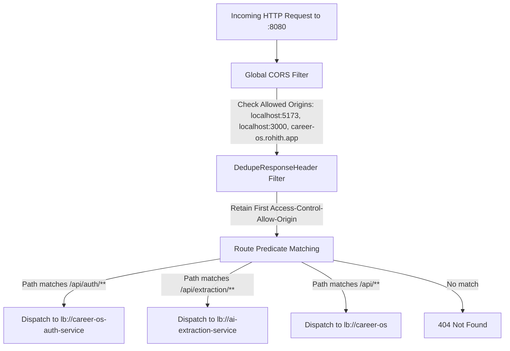

# Career OS — Complete Routing Intelligence & Matrix

> **File:** `routes.md`  
> **Status:** Ground Truth System Specification  
> **Version:** 2.0 (Microservices Architecture)  

---

## 1. Frontend Routing Intelligence (Wouter SPA Router)

The frontend uses `wouter` for lightweight client-side routing, combined with dynamic query parameter views on the dashboard.

### 1.1 Top-Level Client Routes Table

| Route Path | File / Component | Purpose | Auth Required | Navigation Rules / Redirects |
| :--- | :--- | :--- | :--- | :--- |
| `/` | `apps/web/src/pages/LandingPage.tsx` | Public marketing landing page, showcases feature value propositions, hero animations | No | If user is authenticated (`isAuthenticated === true`), automatically redirects to `/dashboard`. |
| `/login` | `apps/web/src/pages/LoginPage.tsx` | User login, registration, password show/hide, and Google/GitHub OAuth triggers | No | If already authenticated, redirects to `/dashboard`. Accepts `?redirect=/path` and `?oauth_error=no_parent`. |
| `/oauth-success` | `apps/web/src/pages/OAuthSuccessPage.tsx`| OAuth callback receiver inside the popup window | No | Extracts `?token=...`, fires `postMessage({ type: 'OAUTH_SUCCESS', token })` to `window.opener`, then invokes `window.close()`. |
| `/dashboard` | `apps/web/src/pages/Home.tsx` | Main application shell, renders `DashboardLayout` and dynamic sub-views based on `?view=` query parameter | **Yes** | If unauthenticated, redirects to `/login`. |
| `/placements` | `apps/web/src/pages/PlacementsPage.tsx` | Dedicated full-page view for corporate placement pipelines, salary filters, status metrics | **Yes** | If unauthenticated, redirects to `/login`. |
| `/add` | `apps/web/src/pages/AddEventPage.tsx` | Full-page standalone form for logging new hackathons, contests, or placement records | **Yes** | If unauthenticated, redirects to `/login`. |
| `/privacy` | `apps/web/src/pages/PrivacyPage.tsx` | Public privacy policy and data governance statement | No | Accessible to both anonymous and authenticated visitors. |
| `/404` | `apps/web/src/pages/NotFound.tsx` | 404 Not Found error page | No | Rendered when an unknown route pattern is visited. |
| `*` (Catch-All) | `apps/web/src/pages/NotFound.tsx` | Fallback catch-all route | No | Directs unmatched URLs to 404 page. |

---

### 1.2 Dashboard Dynamic Sub-Views (`/dashboard?view={name}`)

The main workspace route `/dashboard` uses URL query parameter dispatching to toggle views without full page reloads.

| Query Param (`?view=`) | Component File | Purpose & UI Elements | State / Data Sources |
| :--- | :--- | :--- | :--- |
| `dashboard` *(Default)* | `apps/web/src/components/views/DashboardView.tsx` | Executive summary: metrics banner, today's deadlines, upcoming events, habit progress, quick action buttons | `analyticsApi.dashboard`, `routineApi.list`, `routineApi.reports` |
| `kanban` | `apps/web/src/components/views/KanbanView.tsx` | Drag-and-drop / stage-based Kanban columns (`APPLIED`, `OA`, `INTERVIEW`, `OFFER`, `REJECTED`) | `placementsApi.list`, `placementsApi.update` |
| `calendar` | `apps/web/src/components/views/CalendarView.tsx` | Monthly calendar plotting assessment dates, interview appointments, and event deadlines | `applicationsApi.list`, `placementsApi.list` |
| `analytics` | `apps/web/src/components/AnalyticsDashboard.tsx` | Visual charts: conversion funnel, monthly trends, application status distribution | `analyticsApi.getApplicationsAnalytics`, `placementsApi.getAnalytics`, `placementsApi.getTrends` |
| `skills` | `apps/web/src/pages/SkillsPage.tsx` | Skills directory, category cards, proficiency ratings, batch skill updates | `skillsApi.list`, `skillsApi.create`, `skillsApi.update`, `skillsApi.delete` |
| `routine` | `apps/web/src/components/views/RoutineView.tsx` | Habit tracker: daily checklist, streak counters, completion percentages, history | `routineApi.list`, `routineApi.toggle`, `routineApi.create`, `routineApi.reports` |
| `profile` | `apps/web/src/components/ApplicationProfileForm.tsx` | User profile: college, GitHub, LinkedIn, portfolio, email alerts toggle | `userApi.getProfile`, `userApi.updateProfile`, `authApi.updateDisplayName` |

---

## 2. API Gateway Ingress Routing Table (`apps/api-gateway`)

The Spring Cloud API Gateway runs on port `8080`. All incoming traffic is routed based on path predicates registered in `apps/api-gateway/src/main/resources/application.yml`.

| Route ID | Path Predicate Pattern | Destination URI (Eureka LoadBalancer) | Target Service | Timeouts (Connect / Response) | Auth Requirement at Ingress |
| :--- | :--- | :--- | :--- | :--- | :--- |
| `auth-service-api` | `/api/auth/**`<br>`/api/profile/**`<br>`/oauth2/**`<br>`/login/oauth2/**` | `lb://career-os-auth-service` | Auth Service (:8081) | Connect: `5000ms`<br>Response: `15000ms` | Permitted: `/api/auth/login`, `/api/auth/register`, `/oauth2/**`.<br>Token required: `/api/auth/me`, `/api/profile/**`. |
| `ai-extraction-api`| `/api/extraction/**` | `lb://ai-extraction-service` | AI Extraction Service (:8082) | Connect: `5000ms`<br>Response: `60000ms` | Internal / Protected (Direct client calls or via Backend). |
| `core-backend-service`| `/api/**` | `lb://career-os` | Core Backend (:8085) | Connect: `5000ms`<br>Response: `30000ms` | Permitted: `/actuator/health`.<br>Bearer JWT token required for all `/api/**` business operations. |

---

## 3. Gateway Ingress Filter Pipeline



### 3.1 Gateway Deduplication Rule
```yaml
default-filters:
  - DedupeResponseHeader=Access-Control-Allow-Origin Access-Control-Allow-Credentials, RETAIN_FIRST
```
This filter eliminates duplicate CORS headers injected by both the gateway and downstream Spring Security filters, preventing browsers from rejecting responses.
